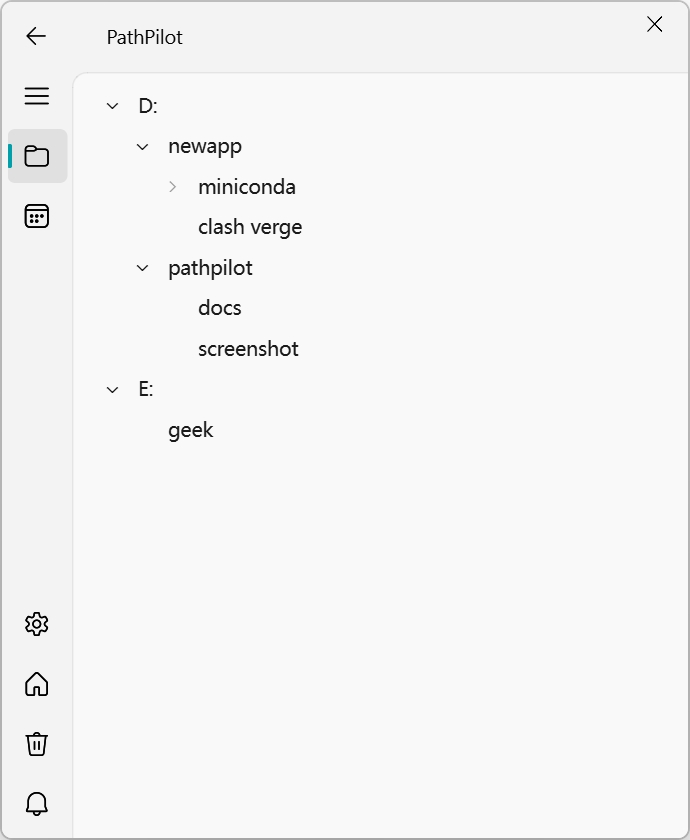
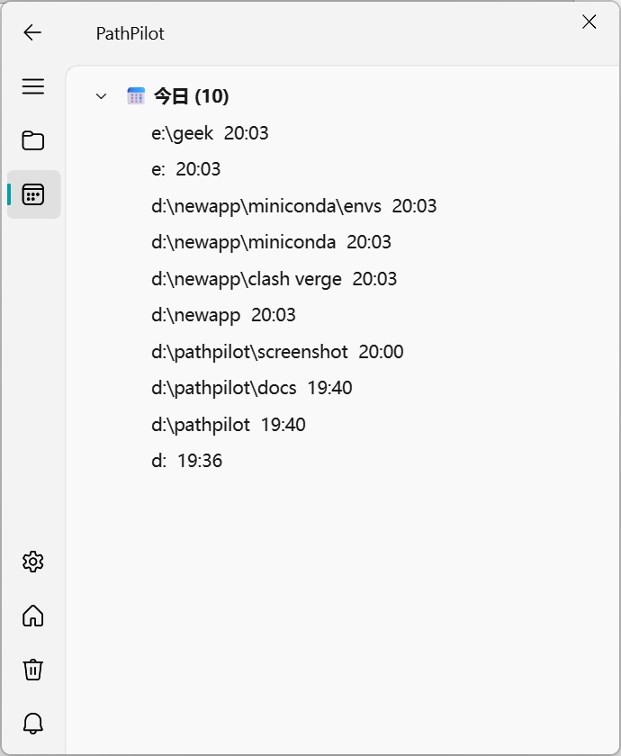

# PathPilot

> Windows 资源管理器隐形导航员 — 无感记录路径，快速跳转



## 功能特性

- **无感路径捕获** — 自动记录资源管理器访问的路径，无需手动操作
- **悬浮球快速访问** — 桌面悬浮球，一键打开路径面板
- **系统托盘** — 后台运行，隐私模式切换
- **智能分类** — 按目录树 / 时间线两种视图浏览历史
- **路径收藏** — 标记常用路径，快速定位
- **导出功能** — 支持 CSV / JSON 格式导出
- **开机自启** — 可选开机自动启动

## 截图

| 目录视图 | 时间视图 |
|:---:|:---:|
|  |  |

## 安装

### 环境要求

- Windows 10/11
- Python 3.11+
- Conda（推荐）

### 从源码运行

```bash
# 克隆仓库
git clone https://github.com/<用户名>/PathPilot.git
cd PathPilot

# 创建环境
conda create -n pysfm python=3.11
conda activate pysfm

# 安装依赖
pip install -r requirements.txt

# 运行
python src/main.py
```

### 使用打包版本

从 [Releases](https://github.com/<用户名>/PathPilot/releases) 下载最新版本，解压后运行 `PathPilot.exe`。

## 技术栈

- **Python 3.11+**
- **PySide6** — GUI 框架
- **PySide6-Fluent-Widgets** — Fluent UI 风格组件
- **SQLite** — 本地数据存储
- **pywin32 / comtypes** — Windows API 调用

## 项目结构

```
src/
├── main.py                 # 入口
├── app.py                  # 应用主类
├── config/                 # 配置管理
├── core/                   # 核心引擎（窗口监控、路径过滤、去重）
├── database/               # 数据库操作
├── gui/                    # 界面（主窗口、悬浮球、托盘、视图）
├── resources/              # 资源文件
└── utils/                  # 工具（日志、导出、自启动）
```

## 开发

```bash
# 激活环境
conda activate pysfm

# 运行测试
python -m pytest tests/ -q

# 打包
.\build.bat
```

## 许可证

MIT License
